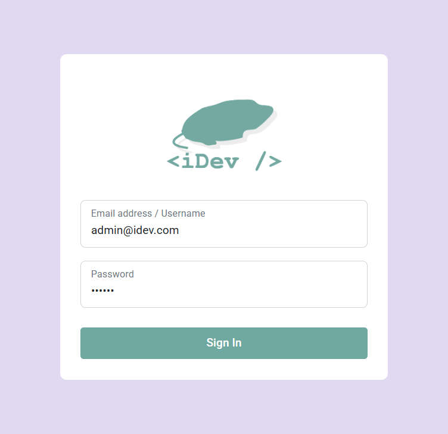
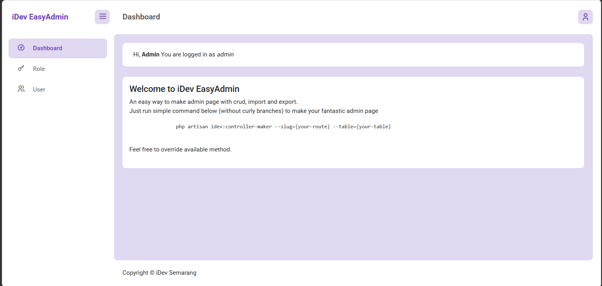
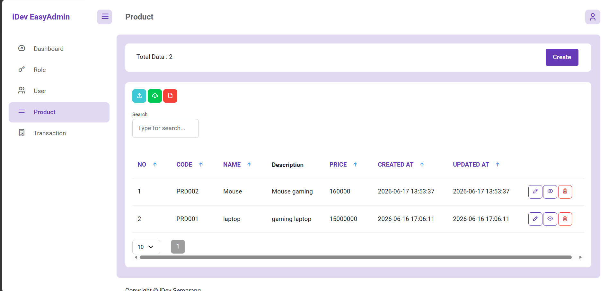
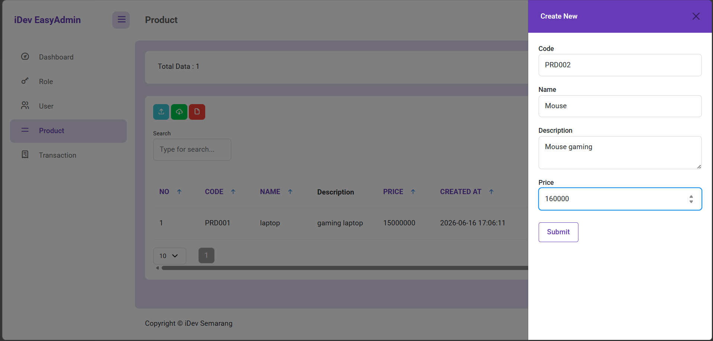
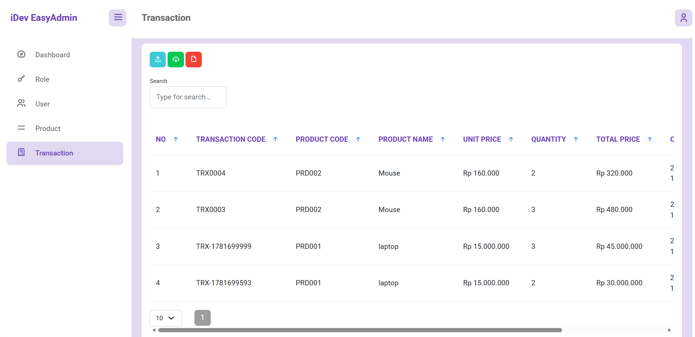
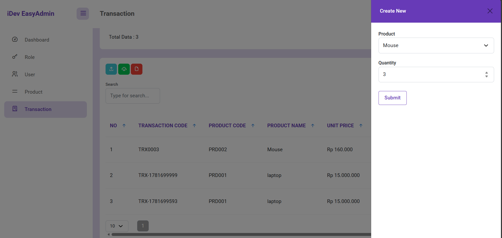

# Multi Database Product & Transaction Management System

A web-based Product and Transaction Management System built with Laravel 11 and EasyAdmin.

This project demonstrates the implementation of a multi-database architecture where product data and transaction data are stored in different database management systems while being managed through a single Laravel application.

---

## Overview

The application consists of two main modules:

- Product Management
- Transaction Management

The Product module stores data in Microsoft SQL Server, while the Transaction module stores data in PostgreSQL.

Laravel acts as the bridge between both databases, allowing data to be retrieved from SQL Server and persisted into PostgreSQL seamlessly.

---

## Key Features

### Authentication & Authorization

- User Login
- User Logout
- Role-Based Access Control
- Permission Management

### Product Management

- Create Product
- View Product
- Update Product
- Delete Product

### Transaction Management

- Create Transaction
- Select Product from Dropdown
- Automatic Product Data Retrieval
- Automatic Total Price Calculation
- View Transaction History
- Update Transaction
- Delete Transaction

### EasyAdmin Features

- Import Excel
- Export Excel
- Export PDF
- Dynamic Sidebar Menu
- Role Management

---

## Technology Stack

### Backend

- Laravel 11
- PHP 8.3
- Eloquent ORM

### Database

- Microsoft SQL Server
- PostgreSQL

### Frontend

- Bootstrap 5
- EasyAdmin Package

### Development Tools

- Composer
- Git
- Visual Studio Code

---

## System Architecture

```text
+----------------------+
|      Laravel 11      |
|     Application      |
+----------+-----------+
           |
           |
     +-----+-----+
     |           |
     |           |
 SQL Server   PostgreSQL
   Product    Transaction
```

---

## Multi Database Implementation

### Product Database

Product data is stored in Microsoft SQL Server.

Stored information includes:

- Product Code
- Product Name
- Description
- Price

### Transaction Database

Transaction data is stored in PostgreSQL.

Stored information includes:

- Transaction Code
- Product Code
- Product Name
- Unit Price
- Quantity
- Total Price

### Data Flow

When a transaction is created:

1. User selects a product.
2. Laravel retrieves product information from SQL Server.
3. Laravel calculates the transaction total.
4. Transaction data is stored in PostgreSQL.

This architecture demonstrates how Laravel can communicate with multiple database systems within a single application.

---

## Database Design

### Products Table (SQL Server)

| Field | Description |
|---------|---------|
| id | Primary Key |
| code | Product Code |
| name | Product Name |
| description | Product Description |
| price | Product Price |
| created_at | Creation Timestamp |
| updated_at | Update Timestamp |

---

### Transactions Table (PostgreSQL)

| Field | Description |
|---------|---------|
| id | Primary Key |
| transaction_code | Transaction Code |
| product_code | Product Code |
| product_name | Product Name |
| unit_price | Product Price |
| quantity | Quantity Purchased |
| total_price | Total Transaction Price |
| created_at | Creation Timestamp |
| updated_at | Update Timestamp |

---

## Installation Guide

### 1. Clone Repository

```bash
git clone <repository-url>
```

Move into project directory:

```bash
cd easyadmin-project
```

---

### 2. Install Dependencies

Install PHP dependencies using Composer:

```bash
composer install
```

---

### 3. Create Environment File

Copy the example environment file:

```bash
cp .env.example .env
```

For Windows:

```bash
copy .env.example .env
```

---

### 4. Configure Environment

Update the `.env` file according to your local environment.

Configure:

- Application settings
- SQL Server connection
- PostgreSQL connection
- Mail configuration (optional)

---

### 5. Generate Application Key

```bash
php artisan key:generate
```

---

### 6. Run Database Migrations

```bash
php artisan migrate
```

---

### 7. Run Seeders (Optional)

```bash
php artisan db:seed
```

---

### 8. Clear Cache

```bash
php artisan optimize:clear
```

---

### 9. Start Development Server

```bash
php artisan serve
```

The application will be available at:

```text
http://localhost:8000
```

---

## Project Structure

```text
app
├── Http
│   └── Controllers
│       ├── ProductController.php
│       └── TransactionController.php
│
├── Models
│   ├── Product.php
│   └── Transaction.php
│
routes
└── web.php

database
├── migrations
└── seeders
```

---

## Workflow

### Product Workflow

```text
User
  │
  ▼
Create Product
  │
  ▼
Store Product
(SQL Server)
```

---

### Transaction Workflow

```text
User
  │
  ▼
Select Product
  │
  ▼
Retrieve Product Data
(SQL Server)
  │
  ▼
Calculate Total Price
  │
  ▼
Save Transaction
(PostgreSQL)
```

---

## Screenshots

### Login Page





---

### Dashboard




---

### Product List


```md

```

---

### Create Product





---

### Transaction List




---

### Create Transaction

> Add screenshot here





---

## Learning Outcomes

This project demonstrates:

- Laravel Multi Database Connection
- CRUD Implementation
- Role-Based Access Control
- Cross-Database Data Processing
- Eloquent ORM Usage
- EasyAdmin Integration
- Software Architecture Design

---

## Author

**Sahrul Amri**

Informatics Engineering 

- Fullstack Web Development
- Machine Learning
- Data Science
- Software Engineering
- Data Analyst

---

## License

This project is developed for educational purposes and technical assessment.
